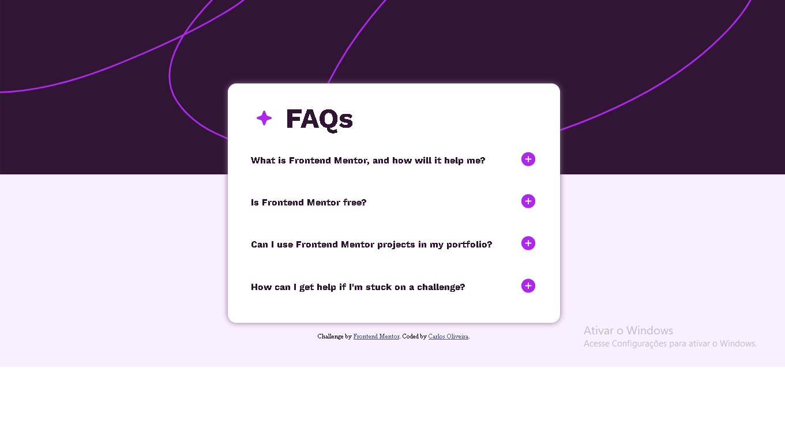

# Frontend Mentor - FAQ accordion solution

This is a solution to the [FAQ accordion challenge on Frontend Mentor](https://www.frontendmentor.io/challenges/faq-accordion-wyfFdeBwBz). Frontend Mentor challenges help you improve your coding skills by building realistic projects. 

## Table of contents

- [Overview](#overview)
  - [The challenge](#the-challenge)
  - [Screenshot](#screenshot)
  - [Links](#links)
- [My process](#my-process)
  - [Built with](#built-with)
  - [What I learned](#what-i-learned)
- [Author](#author)
- [Acknowledgments](#acknowledgments)

## Overview

### The challenge

Users should be able to:

- Hide/Show the answer to a question when the question is clicked
- Navigate the questions and hide/show answers using keyboard navigation alone
- View the optimal layout for the interface depending on their device's screen size
- See hover and focus states for all interactive elements on the page

### Screenshot

### Links

- Solution URL: [Add solution URL here](https://your-solution-url.com)
- Live Site URL: [Add live site URL here](https://your-live-site-url.com)

## My process

### Built with

- Semantic HTML5 markup
- CSS
- Flexbox

### What I learned
I learned so much about some functions in javascript like the "classList.toggle", a function i've already had contact with but hadn't really learned.

## Author

- Frontend Mentor - [@carlos-henriquee](https://www.frontendmentor.io/profile/carlos-henriquee)
- Github - [@carlos-henriquee](https://www.github.com/carlos-henriquee)

## Acknowledgments

I got some help from this video with the js script:
->[Video](https://www.youtube.com/watch?v=HJuD66J7uCE)<   
Thank you :)

And i also had help from someone who commented on my last solution about sizing units in css.
So thank you @DylandeBrujin :)

